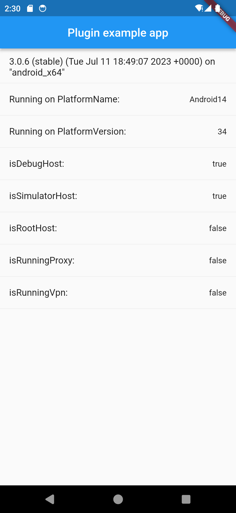
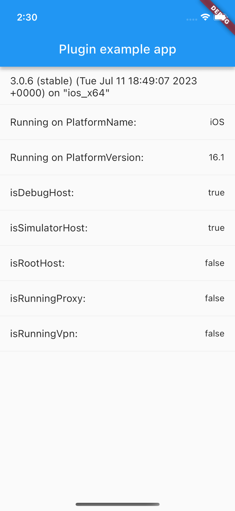

# is_debug

Get host info

## Function

- [x] getHostPlatformName
- [x] getHostPlatformVersion
- [x] isDebugHost
- [x] isSimulatorHost
- [x] isRootHost
- [x] isRunningProxy
- [x] isRunningVpn

|                            |                            |
| :------------------------: | :------------------------: |
|  |  |
